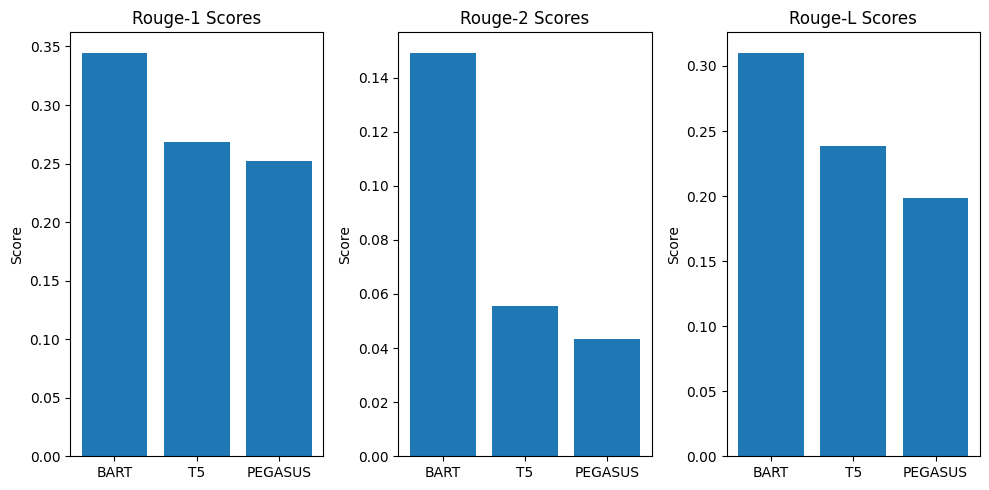

# Text Summarization Techniques Comparison

## Overview
This project aims to explore and compare different abstractive text summarization techniques using deep learning models. The primary goal is to develop summarization agents that can efficiently condense large volumes of text while preserving important information. The project focuses on leveraging Transformers-based models for text summarization.

## Packages Required
To run the code, the following packages are needed on your machine:
- `matplotlib`: For data visualization.
- `rouge`: For calculating ROUGE scores.
- `transformers`: For accessing pre-trained deep learning models.
#
Packages can be installed using pip:
```bash
pip install matplotlib rouge transformers
```
#
## How to Run
To run the script, follow these steps:
1. Ensure Python 3.6+ is installed on your machine.
2. Install all the required packages mentioned above.
3. Run the `MdFahomidHassan_Project2.py` Python file.

## Summarization Agents
Three different summarization agents are utilized in this project:
- **BART** (Facebook's BART model): Known for strong performance in various NLP tasks, including text summarization.
- **T5** (Text-To-Text Transfer Transformer): Excels in text summarization and other natural language understanding tasks.
- **PEGASUS** (Google's PEGASUS model): Specifically designed for abstractive text summarization.

## Performance and Results
The performance of each summarization agent is evaluated using ROUGE scores, which measure the quality of generated summaries compared to reference summaries. Here are the results obtained:

| Score Type | BART  | T5    | PEGASUS |
|------------|-------|-------|---------|
| ROUGE-1    | 0.345 | 0.269 | 0.252   |
| ROUGE-2    | 0.149 | 0.056 | 0.043   |
| ROUGE-L    | 0.310 | 0.239 | 0.198   |

**Figure 1:** Performance and results based on ROUGE scores
#
## Comparisons
### Best Model Selection
BART consistently outperforms T5 and PEGASUS across all ROUGE metrics, making it the best choice among the three models tested in this experiment.
### ROUGE Scores Comparison
BART achieves higher ROUGE scores (ROUGE-1, ROUGE-2, and ROUGE-L) compared to T5 and PEGASUS, indicating its superior performance in generating summaries that are closer to the reference summary.
### Visualization
The bar charts generated in the code visualize the ROUGE scores for each model, providing a clear comparison of their performance across different metrics.
<div align="center">
  
  <p style="text-align:center;">Figure 1: Performance and results based on ROUGE scores</p>
</div>

#
## Conclusion
Based on the experiment results, BART emerges as the most effective summarization agent among the ones tested in this project. Its ability to generate high-quality summaries with ROUGE scores significantly higher than T5 and PEGASUS makes it a preferable choice for abstractive text summarization tasks. However, further experimentation and fine-tuning may be required to optimize performance for specific use cases and datasets.
